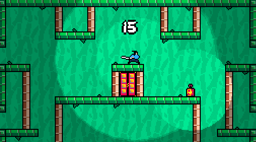

# Análise de movimento em jogos

> **Leitura**
>
> [Capítulo 12 "Asteroids" e Capítulo 13 "Super Mario Bros"](../materiais/Caps12-13_Swink.pdf) em SWINK, S. Game Feel: A Game Designer’s Guide to Virtual Sensation. 1 edition ed. Amsterdam ; Boston: CRC Press, 2008.

Baseado nas ideias de Swink expressas acima, podemos pensar na análise de game feel e de movimento em jogos através das métricas abaixo:

- **Input**: A construção física do dispositivo através do qual a intenção do jogador é expressa ao sistema
- **Resposta**: Como o sistema processa, modula e reage ao input do jogador em tempo real.
- **Contexto**: O efeito do espaço simulado na sensação do jogo. Como a colisão e level-design dão significado ao movimento e controle.
- **Metáfora**: como a representação e tratamento mudam as expectativas do jogador sobre o comportamento, movimento e interações dos objetos do jogo.
- **Regras**: Como relações arbitrárias entre variáveis e grandezas do jogo mudam a percepção de objetos do jogo, definem desafios e modificam sensações de controle.
- **Polimento**: representações e efeitos audiovisuais que explicam e alteram nossa percepção de movimento e controle sem alterar sua simulação.

Nos capítulos indicados como leitura, ele aplica esse modelo a dois jogos clássicos, *Asteroids* e *Super Mario Bros*.

## *Desviaroids* (controle tipo 3)

### Input

- Posição do mouse: controle analógico e preciso, que depende do tamanho da tela e sensibilidade (velocidade) de movimento do cursor.
- Clique do mouse: controle digital que pode ser acionado ao mesmo tempo que os deslocamentos do mouse.

### Resposta

- O clique do mouse acelera de forma lenta, com ataque e release lentos, na ordem de 2 segundos de duração, com uma aceleração máxima no sustain.
- A posição do cursor altera a rotação da nave, mas não de forma imediata. A nave tenta apontar para o cursor, mas de forma atenuada (a interpolação faz o final da rotação ser mais lento que o início).
- No jogo, existe atrito e arrasto no espaço, que faz a velocidade de deslocamento diminuir progressivamente. A velocidade e a aceleração da nave estão desvinculadas. Não existe gravidade. Essas propriedades alteram a forma que a aceleração e rotação criam a sensação de movimento do jogo.

### Contexto

- Os asteróides de tamanho variável criam obstáculos progressivamente mais difíceis, assim como áreas vazias para permitir o contraste entre desviar freneticamente e descansar. O seu movimento é constante, mas suas colisões e rotação fazem ser difícil de prever totalmente onde estarão a cada momento, mas permite calcular trajetórias.
- As estrelas a serem coletadas tem um papel importante, pois elas tornam uma determinada área da fase mais desejável, criando um desafio para o jogador.

### Metáfora

- É bastante icônica: reconhecemos naves e asteróides, mas não temos preocupações com realismo. Essa metáfora ajuda a explicar o movimento da nave e sua materialidade, mas sem criar expectativas de realismo.

### Regras

- O fato de que coletar estrelas é a única forma de ganhar pontos faz com que o jogador fique constantemente se desafiando a coletá-las e se arriscar no processo. É um tipo de risco-recompensa bastante básico.
- Qualquer colisão com asteróides destrói o jogador, criando um alto nível de risco para essas interações, enfatizando o verbo principal de *desviar*.

### Polimento

- O rastro de partículas que a nave deixa nos ajuda a entender o movimento da mesma.

## *Samurai Lantern*

Será realizado em sala.
