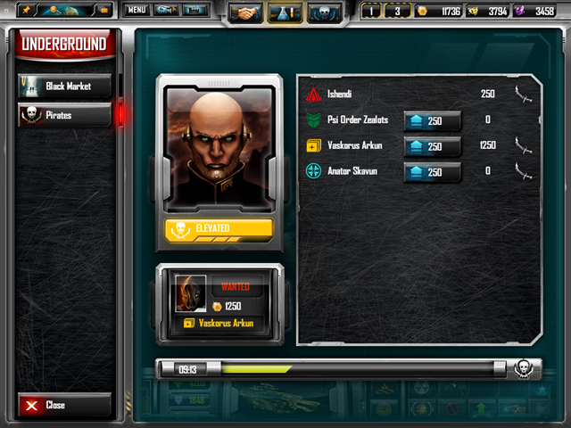

# Análise de sistemas em jogos

Nesta aulas, vamos partir dos elementos de sistemas discutidos na aula da semana passada para iniciar a análise de alguns exemplos de sistemas em jogos.

## Um passo-a-passo para análise

Para guiar nossa análise, vamos pensar nos seguintes pontos:

1. Qual o contexto de funcionamento desse sistema?
1. Quais são os principais objetos do sistema? Quais são seus principais atributos?
1. Quais são as principais etapas de funcionamento do sistema? Quais eventos são chave para seu comportamento?
1. Pensando na experiência do jogador, quais são as principais consequências desse sistema? Quais objetos ou relações internas ganham importância para o jogador?
1. Como o sistema incorpora sorte e habilidade do jogador?
1. Como o sistema trata as relações internas entre diferentes elementos? Existem feedbacks positivos ou negativos? Quais afetam os jogadores?
1. O sistema tem impacto nas estratégias elaboradas pelo jogador? Como ele dificulta ou facilita os objetivos do jogador?

## Estudos de caso

### Sistema de combate em *Myre*

Os principais objetos em Myre são as cartas. Elas servem tanto para atacar o oponente quanto para marcar a vida do jogador. Essa duplicidade gera uma tensão em como utilizá-las a cada momento da partida. As regras que definem o combate no jogo criam uma relação interna entre os dois papéis das cartas que criam novas decisões e estratégias para os jogadores.

Quando pensamos no sistema de combate de Myre, como podemos responder as perguntas abaixo?

- Quais são as principais estratégias utilizadas? Quais objetos são fundamentais para cada uma?
- Como o sistema cria significado para o jogador? Quais elementos estão em destaque?
- Quais forças aumentam ou diminuem a desigualdade entre jogadores? Como essa relação evolui ao longo do jogo?
- Como o jogo trata a questão da sorte e da habilidade?

### Sistema de diplomacia em *Sins of a Solar Empire*

Neste jogo, os diferentes jogadores têm a opção de colocar recompensas contra outros jogadores. Após um período de leilão no qual os jogadores podem se juntar para aumentar a recompensa contra outro jogador, o jogador que tiver a maior recompensa contra si será atacado por uma frota pirata.

*Tela de leilão de recompensas em Sins of a Solar Empire.*

Esse sistema permite toda uma séria de manobras entre jogadores, assim como afeta a forma com que recursos e defesas são distribuídos pelos sistemas do jogador. O sistema também tem repercussões econômicas: para poder investir em recompensas, o jogador deve focar sua economia na conversão de outros recursos em créditos, a única forma de pagamento aceita.

### Sistema de level-up e poderes em *[Kerkerkruip](https://kerkerkruip.org/)*

Nesse jogo, cada inimigo apresenta um nível de perigo diferente. Quando um inimigo é derrotado, o jogador recebe parte de seus poderes. Se depois derrotar inimigos de nível menor, esses poderes se acumulam. No entanto, se o jogador derrotar um inimigo mais poderoso, esse novo poder toma o lugar dos anteriores. Dessa forma, surge toda uma gama de escolhas estratégicas para a abordagem do jogador em relação ao labirinto em que se encontra e se deve ou não enfrentar os inimigos em uma determinada ordem. É um sistema com poucos objetos em si (poderes, nível de perigo), mas no qual atributos e relações internas criam dinâmicas significativas para o jogador.
