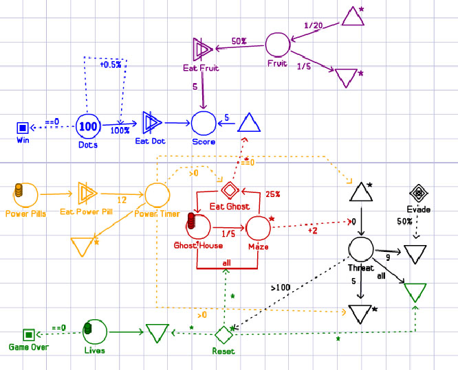
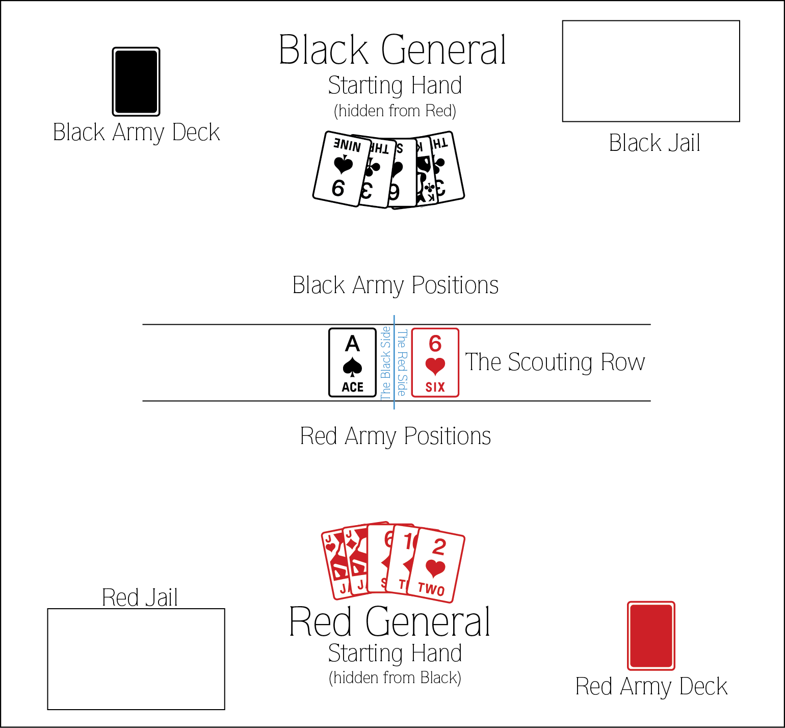

# Jogos e sistemas

>**Leitura**
>
> *Capítulo 5 "Systems"* em  SALEN, K.; ZIMMERMAN, E. Rules of play : game design fundamentals. Cambridge  Mass.: MIT Press, 2003.

Uma definição simples de sistema seria: um grupo de elementos inter-relacionados, interdependentes ou interagindo formando um todo complexo (Salen & Zimmerman, 2003). Uma outra forma de entender sistemas seria olhar para diferentes elementos que os constituem e aplicar essa análise a partir de diferentes pontos de partida ou enquadramentos. Os elementos de um sistema são, de acordo com Littlejohn (apud Salen & Zimmerman, 2003):

- **Objetos**: podem ser abstratos ou concretos, mas são as partes e variáveis integrantes do sistema.
- **Atributos**: as propriedades e qualidades do sistema e seus objetos.
- **Relações internas**: é o que conecta e explica as interações entre os objetos e atributos do sistema.
- **Ambiente**: é o contexto externo no qual o sistema existe e que o determina de diferentes formas.

A **complexidade** de um sistema é dada pelo grau de inter-relação entre seus diversos elementos. Sistemas com uma relação mais interdependente são mais complexos, mesmo que modelem comportamentos simples. Outro conceito importante ao pensar sistemas é a ideia de **dinâmica** ou os padrões que surgem a partir desse sistema em funcionamento. Uma ferramenta interessante para visualizar dinâmicas é a [Machinations](http://www.jorisdormans.nl/machinations/). Considerar dinâmicas de forma rigorosa permite detectar **furos**, falhas onde os jogadores podem abusar do sistema para ganhar vantagens injustas ou indesejadas (Fullerton, 2008, p. 310).

*Diagrama de Pac-Man na ferramenta Machinations.*

#### Atividade

1. Identificar sistemas nos exemplos pesquisados, pensando aspectos desses exemplos que são bem equilibrados **como sistemas**. Quais elementos são mais fáceis de identificar? Quais são mais vitais para o (des)equilíbrio notado?
2. Conhecer o jogo [Myre](http://www.stfj.net/index2.php?project=art/2016/Myre), de Zach Gage, explicando regras. A análise do equilíbrio vai ficar para semana que vem, quando faremos análise dele e de um sistema em jogo digital simples.

**Mesa do jogo Myre.**

### Exercício

Criar um jogo simples de combate entre dois jogadores, usando como objetos apenas um baralho tradicional, 2 dados de 6 faces e, se necessário, peças para pontos. As partidas devem ter no máximo 20 a 30 minutos.
