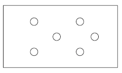
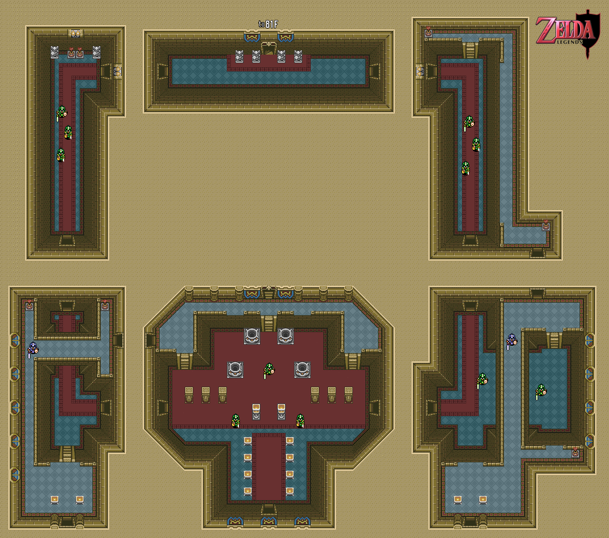

# Level design e equilíbrio

> As leituras que serão trabalhadas nessa semana são:
>
> - ANTHROPY & CLARK - Capítulo 3;
> - SCHELL - Capítulo 19;

## Cenas

De acordo com Anthropy e Clark (2014), uma **cena** é a unidade mais básica de ritmo de um jogo e isso varia de jogo para jogo. A principal função de uma cena é introduzir e desenvolver as regras do jogo, através das escolhas e dos objetos que criamos. É fundamental introduzir regras de forma clara, pois elas são a base para criar escolhas para os jogadores, sejam as regras relativas a verbos (mecânicas), objetos e as relações entre si.

Cenas normalmente tem um propósito claro, podendo utilizar da ideia de camadas para tornar esse propósito realidade. Camadas seriam interrelações simultâneas entre as regras, como dois tipos de movimento a serem considerados ao mesmo tempo, por exemplo. Para elaborar e refinar essas criações são necessárias várias etapas de preparação e criação, seguidas de testes. Cenas, em muitos casos, acontecem em um espaço de jogo, que está bastante relacionado às possibilidades que o jogo permite assim como uma representação mais direta de espaço físico.

## Como entender espaços de jogo?

Totten (2014) sugere dez questões para melhor analisar o espaço de jogos.

1. Identificar o tipo de gameplay que acontece nesse espaço. Que verbos e regras são usados?
2. Observe enquanto jogo, note elementos visuais tanto acima quanto abaixo do plano central do jogo.
3. Como o som e a luz fazem você se sentir em um determinado espaço?
4. Como é o ritmo da fase? Ela te acelera ou torna mais lento? Existe um incentivo à curiosidade?
5. Existe um estilo de jogar favorecido pela fase ou ela permite vários?
6. Como o espaço apoia e desenvolve a narrativa do jogo? Novas informações surgem através do espaço? Existem eventos narrativos inscritos nessa fase?
7. Como esse espaço se relaciona com precedentes históricos e de jogos anteriores ou até mesmo dentro do próprio jogo?
8. Procure analisar a composição, proporções e ritmos do ambiente e dos elementos de arte.
9. Como a geometria do espaço se relaciona com os movimentos do avatar? Existem áreas externas a essa possibilidade? Qual o significado delas no jogo?
10. Que elementos de arte se repetem? São interativos?

### Modelos de espaços

Podemos entender espaços em jogos como seguindo diferentes modelos básicos, listados abaixo (Schell). Isso se aplica à lógica do espaço, não apenas à sua representação visual.

| Modelo | Rascunho |
| --- | --- |
| Lineares |  |
| Em grade |  |
| Redes |  |
| Pontos |  |
| Territórios |  |

### Estruturas vivas

Baseado nos conceitos do arquiteto Christopher Alexander (*A Pattern Language, Timeless Way of Building*), Schell propõe uma lista de propriedades de espaços bem desenhados e que dão uma sensação de vida. Essas mesmas propriedades podem ser pensadas quando estamos criando espaços em jogos e determinando a relação dos objetos (sejam personagens ou coisas) com eles.

#### Níveis de escala

Coisas tem diferentes tamanhos e diferentes relações a partir disso.

#### Centros fortes

Centros ajudam a dar uma noção de objetivo, de importância.

#### Fronteiras

Vários tipos de fronteiras existem em jogos. Como são as do seu espaço?

#### Repetição alternada

Desde tabuleiros de xadrez até fases de jogos casuais, esse tipo de espaço ou padrão ajuda a criar uma série de feitos, como tensão, ordem, ritmo.

#### Uso do espaço positivo e negativo

O contraste entre aquilo que está à frente e aquilo que está no fundo é determinante para criar espaços interessantes.

#### Boa forma

Use formas que comunique aquilo que você procura, não deixe essa escolha ao acaso ou convenção.

#### Simetrias localizadas

Pense em como diferentes partes são semelhantes ou evocam padrões comuns. Simetrias ajudam o jogador a entender o espaço e a imaginar ordem.

#### Interrelações profundas

Alguns espaços e regras estão tão interconectados que sem um, o outro deixa de fazer sentido. isso é mais comum do que parece e pode ajudar muito na hora de criar espaços em jogos.

#### Contraste

Contraste traz a sensação de poder, de força. Use com cuidado e de forma consciente.

#### Gradações

Muitas propriedades e qualidades mudam gradualmente. Entenda os gradientes e use-os de acordo com seus objetivos.

#### Irregularidades

Simetria, ordem e repetição são realmente raros no mundo vivo. Use "imperfeições", desgastes e irregularidades a seu favor.

#### Ecos

Ecos são repetições que conectam diferentes elementos, como semelhanças entre portais e portas, chefões e inimigos, ruínas e prédios funcionando.

#### Vazios

Em muitos lugares centrais, existe algum tipo de "vazio" ou centro de importância sendo preservado ou marcado. Pense em altares, fontes, lagos, praças.

#### Simplicidade e calma

Às vezes, a criação de algumas regras simples ajuda a criar um todo coeso e fácil de ser entendido. Experimente com essa propriedade.

#### Conjunto

Em espaços, muitos dos elementos estão claramente interconectados e raramente existem de forma totalmente separada de seus arredores. Use essa propriedade para tornar seus ambientes mais orgânicos e com um senso de história conjunta.

## Exemplos

#### Legend of Zelda (NES)

#### A Link to the Past (SNES)

#### REDDER (PC)

## Referências

- ANTHROPY, A.; CLARK, N. A Game Design Vocabulary: Exploring the Foundational Principles Behind Good Game Design. 1 edition ed. Indianapolis, IN: Addison-Wesley Professional, 2014.
- SCHELL, J. A arte do game design: o livro original. [s.l.] CRC Press, 2010.
- TOTTEN, C. W. An architectural approach to level design. Boca Raton, FL: CRC Press, 2014.
