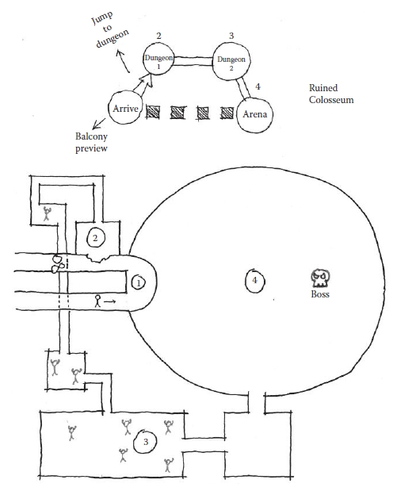
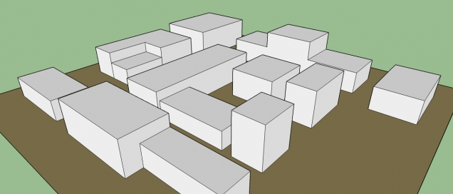

# Prática de level design

Vamos prosseguir utilizando o sistema de jogo em plataforma apresentado na aula passada. Para relembrar, vimos como usar as ferramentas Tiled e Tiled2Unity para criar mapas e importá-los dentro da engine Unity. Isso é o que chamamos de *pipeline*: um fluxo de tarefas e ferramentas com foco na parte técnica de realizar uma tarefa (no caso, criar uma fase). Hoje vamos focar na prática e definição de um fluxo de trabalho (workflow) que é mais voltado a combinar o trabalho conceitual e técnico.

## Workflow para level design

### 1. Determinar experiência desejada (*genius loci*)

O conceitos de **genius loci** vem da Roma Antiga. Este seria o espírito de um lugar, sua essência intangível. Definir a experiência que se deseja que o jogador tenha em um espaço envolve desde considerações sobre a dificuldade da fase e as habilidades que já foram ensinadas ao jogador, como essa noção de construção de mundo, de criação de um todo que o abriga. Isso é a primeira fundação em torno da qual se constrói o resto, pois define o estilo  e arte, o layout do espaço, o som, a luz, a câmera, etc. É importante equilibrar essa necessidade funcional da fase com sua construção imaginária e subjetiva.

### 2. Definir métricas do jogador

As métricas do jogador são a representação das relações dos verbos do jogador com o espaço do jogo. Como são os movimentos? Como ele ocupa o espaço? Medidas como velocidade, tamanho, campo de visão, relação com a câmera, são todas métricas relevantes. Claro que esses valores mudam de jogo para jogo.

### 3. Chegadas e *genius loci*

O primeiro contato, a **chegada**, com um espaço é fundamental para determinar a dinâmica da experiência. A forma como isso é construído tem de ser bem pensada e pode utilizar-se de uma série de elementos, desde os tipos de espaço delimitados acima como campos de visão, som, arte e câmera. Isso vale para o início de fases ou de sub-áreas menores. A chegada é um evento central para a narrativa do percurso do jogador.

### 4. Diagrama de "molecule design"

O método para level design chamado de *molecule design* é proposto por Totten como forma de esquematizar os principais espaços de um level ou espaço de jogo, reconhecendo que raramente um level é definido por um único tipo de espaço. É bastante simples e auto-explicativo, vide exemplo acima. Também é importante, além da ordem e conexões entre espaços, marcar qual é o verbo que liga esses espaços, pois existem outras relações além do deslocamento, como uma vista, por exemplo.

**Tipos de espaço**

- Corredores
- Espaços íntimos
- Refúgio
- Campos abertos

### 5. Blocking

**Blocking** ou *whiteblocking* é nome que se dá ao processo de construir o layout macro de uma fase usando blocos simples sem textura, para estudar o volume e escala dos diferentes elementos da fase. Nessa etapa, o mais importante é conseguir sentir a relação entre as métricas do jogador (sua velocidade, movimento, câmera) e os volumes do espaço, se possível e forma interativa em uma engine. Depois dessa etapa, com as principais áreas definidas, artistas visuais começam a elaborar os elementos finais. Um processo semelhante se aplica a jogos 2D, mas utilizando formas mais simples e blocos temporários.

## Exercícios

1. Escolher alguma mecânica presente no jogo-exemplo para focar de forma principal. Anotar também métricas do jogador que sejam relevantes.
2. Determinar que tipo de lugar / *genius loci* é mais apropriado para trabalhar essa mecânica.
3. Elaborar um diagrama de molecule design definindo principais áreas da fase e sua relação.
4. Fazer o blocking da fase. Testar dentro da engine.
5. Finalizar a fase (acertos pontuais, popular com objetos e comunicação) e testar na engine. 

## Referências

- TOTTEN, C. W. **An architectural approach to level design**. Boca Raton, FL: CRC Press, 2014.
