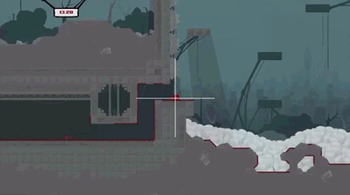

# Técnicas para equilibrar movimento

## Protótipo de movimentação

1. Criar lógica básica de movimentação do objeto.
2. Criar um contexto básico onde esse movimento acontece.
3. Preparar a lógica de câmera adequada a esse movimento e contexto.
4. Iterar essas etapas incluindo regras e polimentos adequados, realizando testes no final de cada iteração.

[O exemplo criado em aula está neste link.](../materiais/TecnicasMovimento.zip)

### Dicas e técnicas

- Usar a técnica das metades e dobros (detalhes abaixo) na hora de estimar valores para movimentação.
- Alterar um parâmetro apenas a cada teste.
- Criar pequenos scripts de teste e visualização de variáveis. O sistema de `Gizmos` da Unity é bastante prático para isso.
- Na hora de criar lógica para câmeras, você pode começar se perguntando:
    - Quais aspectos do movimento você quer enfatizar?
    - Onde vai estar a atenção do jogador?
    - Como a câmera afeta (ou não) o movimento?
    - Qual o ritmo / estética do meu jogo? Faz sentido uma câmera rápida?
    - Na perspectiva do meu jogo, como posso trabalhar a escala do movimento?
- Quando estiver pensando em câmeras, não reinvente a roda. [Dê uma olhada no que já existe](http://www.gamasutra.com/blogs/ItayKeren/20150511/243083/Scroll_Back_The_Theory_and_Practice_of_Cameras_in_SideScrollers.php) e tente avaliar o que se encaixa nas suas necessidades e onde você pode inovar também.

*Acima:* Uso de um limite lateral para câmera e uma área de aceleração.

*Acima: Uso de lerp (interpolação linear) e position-locking.*

#### Lembrete: Metades e dobros

Quando se está equilibrando quantidades numéricas, é comum que as pessoas tentem acertar números fazendo pequenas alterações. Esse método pode funcionar, mas é mais lento do que o método de alterar valores sempre em metades e dobros. Quando precisar aumentar um `valor1`, dobre-o. Se o novo resultado, `valor2` ficar muito acima do desejado, divida a diferença entre `valor2` e `valor1` pela metade para encontrar o `valor3`. Com isso você está realizando um tipo de busca binária entre os valores possíveis.
